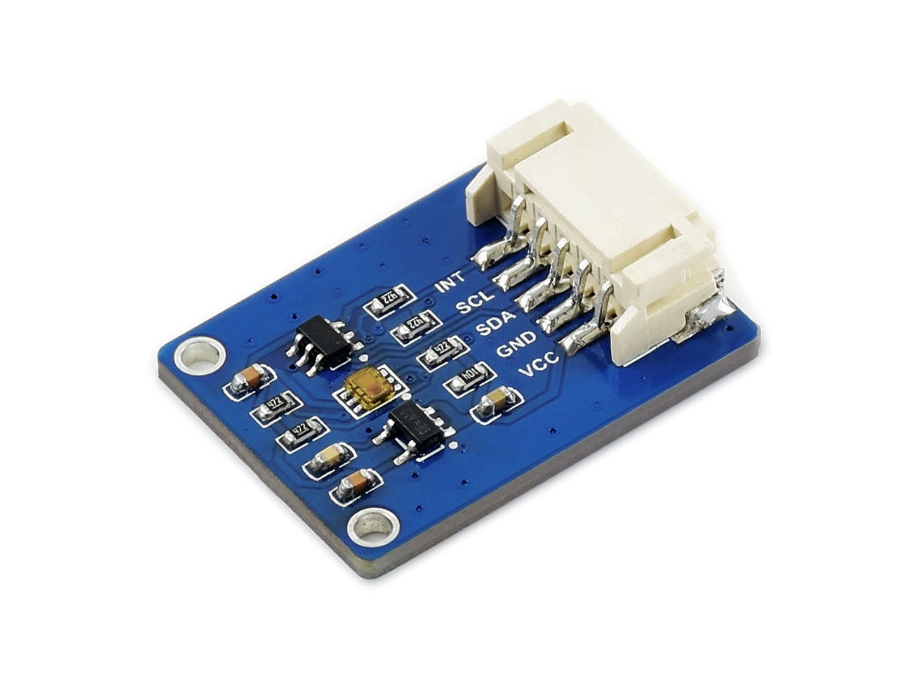

# TSL25911 Light Sensor
## waveshare electronics

http://www.waveshare.net  
https://www.waveshare.com  

## 中文 ## 
http://www.waveshare.net/shop/.htm  
我是一款高灵敏度的数字环境光传感器，具有600M:1宽动态范围，可检测高达 88000Lux 的光强，I2C接口控制，低功耗，适合在各种光照条件下工作。

## English ##
https://www.waveshare.com/.htm  
I am a high-sensitivity digital ambient light sensor with 600M:1 wide dynamic range, capable of detecting light intensity up to 88000Lux, I2C interface control, low power consumption, suitable for working under various lighting conditions.

